# 1. Introduction (Very simple)

This repository contains a **distributed order processing platform** for a sports store.

In simple words, it is an online shop where:

- a customer can browse products and place an order
- the system checks the order in several steps
- different programs help finish the order
- an admin can watch what is happening

The problem it solves is this:

When a customer buys something, the system should not do everything in one big block of code.  
Instead, it splits the work into smaller jobs:

- one part handles the website
- one part stores the order
- one part checks inventory
- one part handles payment workflow
- one part creates shipping information

That is what **distributed order processing platform** means here:

> one shopping system, but built from several separate services that talk to each other

Think of it like a small company:

- the customer talks to the **front desk**
- the front desk sends work to the **correct team**
- each team does one job
- everyone writes results into the **same shared system**

In this project:

- the **front desk** is the API
- the **teams** are the worker services
- the **message post office** is RabbitMQ
- the **shared notebook** is SQL Server

---

# 2. Big Picture (High-Level Overview)

This system has these main parts:

- a **Blazor customer frontend** for shopping
- a **React admin dashboard** for operations
- an **ASP.NET Core API** in the center
- **RabbitMQ** for passing work between services
- three **worker services** for inventory, payment, and shipping
- **SQL Server** for data storage
- **Stripe** for the customer payment checkout page

Why are there multiple services?

- because each service has one clear responsibility
- because work can continue in the background
- because one step can fail without crashing the whole website
- because this is closer to how real distributed systems work

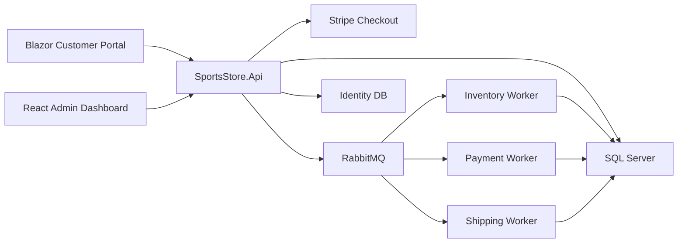

## A very simple mental model

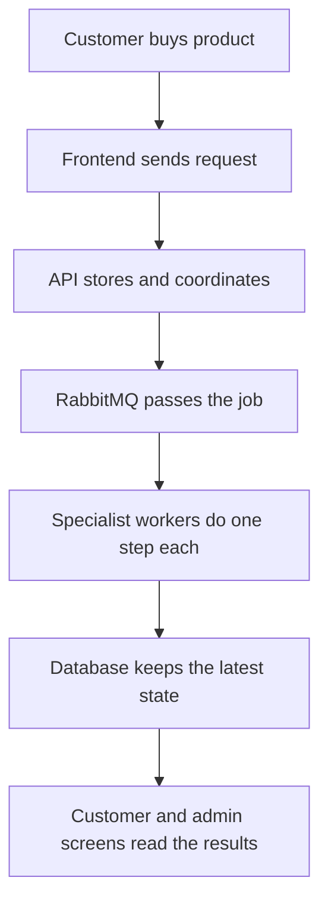

---

# 3. Meet the Main Components

The system is easier to understand if you treat every part like a small worker with one job.

| Part | Simple job | Where it lives |
| --- | --- | --- |
| Blazor frontend | Customer shopping site | `SportsStore.Blazor/` |
| React admin dashboard | Admin monitoring screen | `admin-dashboard/` |
| API | Main entrance for both frontends | `SportsStore.Api/` |
| RabbitMQ | Passes messages between services | `docker-compose.yml` |
| Inventory worker | Checks if requested items can be fulfilled | `SportsStore.Inventory.Worker/` |
| Payment worker | Continues the payment workflow after inventory success | `SportsStore.Payment.Worker/` |
| Shipping worker | Creates shipment data | `SportsStore.Shipping.Worker/` |
| SQL Server | Stores products, orders, and processing records | `docker-compose.yml` |

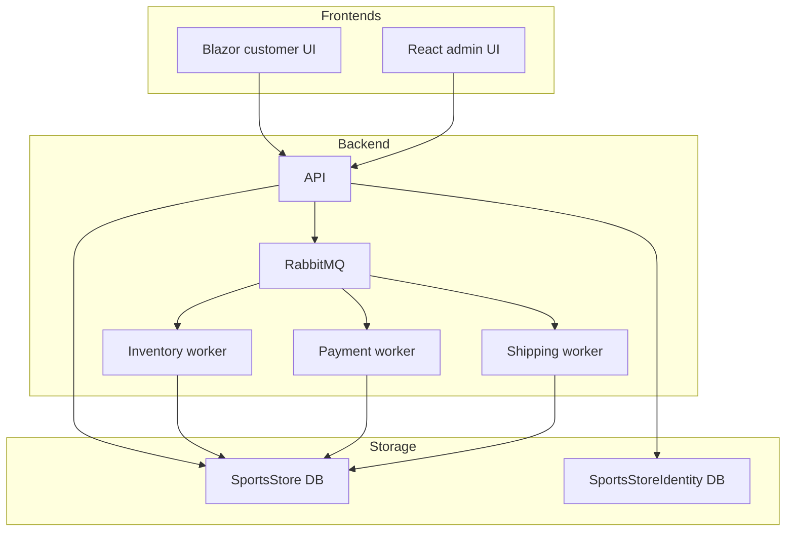

## Important note for students

This project uses **one real external payment screen** and **some simulated worker decisions**:

- Stripe is used to create and confirm the customer checkout session
- inventory approval is simulated by simple code rules
- payment worker approval is simulated by simple code rules
- shipping creation is simulated by simple code rules

So the project is great for learning the architecture, even if not every business step talks to a real outside company.

---

# 4. What Each Project in the Repository Does

## Projects inside `SportsSln.sln`

| Project | What it does in simple words |
| --- | --- |
| `SportsStore.Api` | Exposes HTTP endpoints, receives requests, runs commands and queries, saves orders, and publishes RabbitMQ messages |
| `SportsStore.Application` | Holds use cases such as checkout, queries, commands, DTOs, and message contracts |
| `SportsStore.Domain` | Holds the core business data types like `Order`, `Product`, `PaymentRecord`, and `ShipmentRecord` |
| `SportsStore.Infrastructure` | Connects the app to SQL Server, RabbitMQ, Stripe, caching, and configuration |
| `SportsStore.Blazor` | Customer-facing shopping application |
| `SportsStore.Inventory.Worker` | Background service that listens for `order.submitted` messages |
| `SportsStore.Payment.Worker` | Background service that listens for `inventory.confirmed` messages |
| `SportsStore.Shipping.Worker` | Background service that listens for `payment.approved` messages |
| `SportsStore.Tests` | Automated tests for controllers, handlers, domain logic, cache logic, RabbitMQ setup, and frontend API clients |

## Important official component outside the `.sln`

| Component | Why it is outside the `.sln` |
| --- | --- |
| `admin-dashboard` | It is a React/Vite project, not a `.NET` project, so it is kept as a top-level runtime component instead of a fake `.csproj` |

## Visual map of the codebase

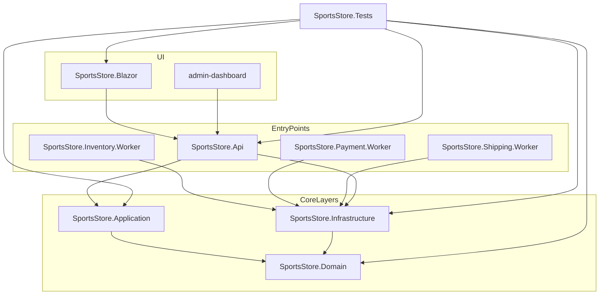

## One more repo note

There is also a `SportsStore/` folder in the repository.  
It is an older MVC-style application and is **not the main distributed runtime** used by `docker-compose.yml` for this assignment.

---

# 5. Phase 1: What Happens Before RabbitMQ Starts Working

This first phase is the **customer checkout phase**.

At this point, the customer is still using the website, and the system is preparing the order.

## Step-by-step

1. The customer browses products in the Blazor frontend.
2. The customer adds items to the cart.
3. The cart is stored in **browser session storage**, not in SQL Server yet.
4. The customer opens the checkout page and enters shipping details.
5. Blazor calls `POST /api/orders/checkout`.
6. The API creates a **temporary pending checkout** in memory.
7. The API asks Stripe to create a checkout session.
8. The browser is redirected to Stripe.
9. After successful payment, Stripe sends the browser back to `/checkout/complete`.
10. Blazor calls `POST /api/orders/complete`.
11. The API checks Stripe again to confirm the session is really paid.
12. Only then does the API create and save the order in SQL Server.
13. After saving the order, the API publishes the first RabbitMQ message.

## Visual checkout flow

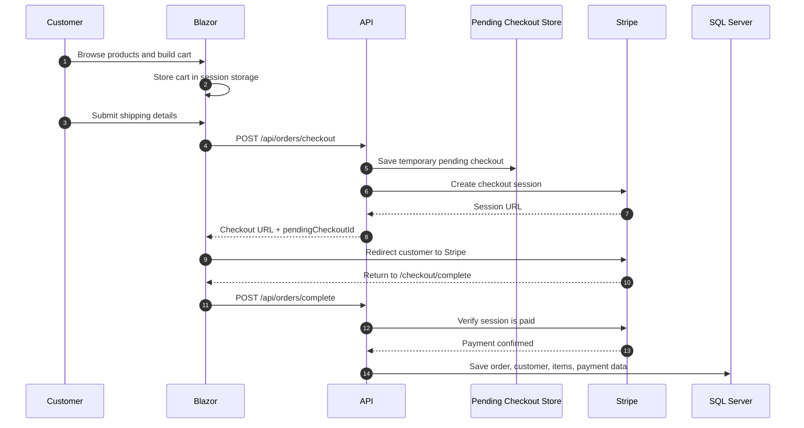

## Why the order is not saved immediately

The code deliberately waits until Stripe says the payment session is **paid**.  
That means:

- no paid confirmation, no saved order
- the system avoids creating final orders for unfinished payments

## Important temporary storage used here

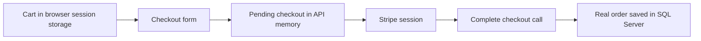

> Simple rule: before payment is confirmed, the system uses temporary storage.  
> After payment is confirmed, the system creates the real order.

---

# 6. Phase 2: What Happens After the Order Is Saved

Now the order exists in the database, and the **background workflow** begins.

This is where RabbitMQ becomes very important.

## The student version

Think of this phase as a conveyor belt:

- the API puts the order on the belt
- inventory picks it up first
- if inventory is okay, payment continues
- if payment is okay, shipping continues
- each step writes back to the database

## Visual async processing flow

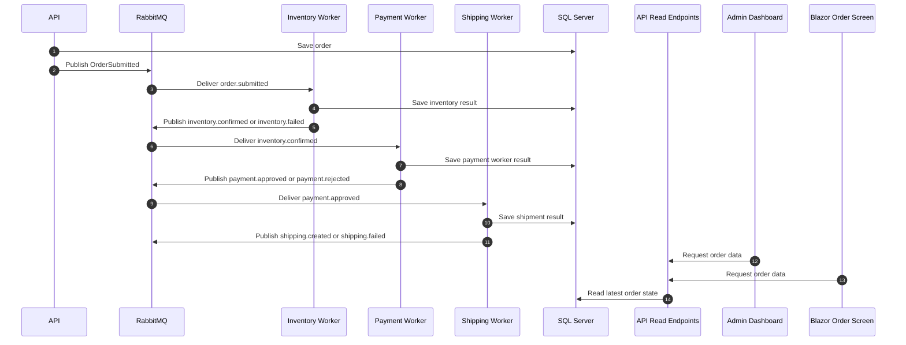

## Actual event chain used in code

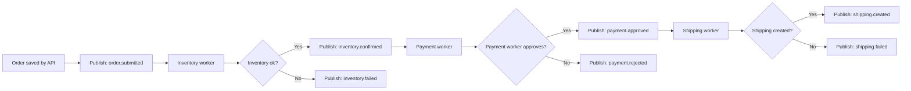

## Important implementation note

There are **two payment-related moments** in the current code:

- Stripe payment is confirmed when the order is created
- later, the payment worker still performs its own internal payment step in the asynchronous pipeline

For a beginner, the easiest way to understand this is:

> Stripe handles the customer checkout page, while the payment worker represents a later back-office payment step in the distributed workflow.

---

# 7. How RabbitMQ Coordinates the Workflow

RabbitMQ is the **message broker**.

That means:

- it does not sell products
- it does not save orders
- it does not draw web pages
- it simply receives messages and forwards them to the correct worker

## Best beginner analogy

> RabbitMQ is like a post office.  
> The API and workers write letters.  
> RabbitMQ reads the address on the letter and puts it into the right mailbox.

## The RabbitMQ topology in this project

- one **topic exchange**: `sportsstore.orders`
- one queue for inventory: `sportsstore.inventory`
- one queue for payment: `sportsstore.payment`
- one queue for shipping: `sportsstore.shipping`

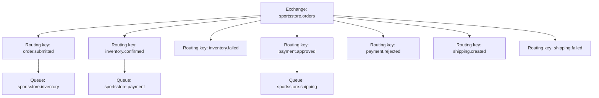

## Which message goes where

| Message | Who publishes it | Where RabbitMQ sends it |
| --- | --- | --- |
| `order.submitted` | API | Inventory queue |
| `inventory.confirmed` | Inventory worker | Payment queue |
| `inventory.failed` | Inventory worker | No next worker in current flow |
| `payment.approved` | Payment worker | Shipping queue |
| `payment.rejected` | Payment worker | No next worker in current flow |
| `shipping.created` | Shipping worker | End of workflow in current flow |
| `shipping.failed` | Shipping worker | End of workflow in current flow |

## Why this is useful

Without RabbitMQ, the API would need to call every worker directly and wait.  
With RabbitMQ:

- the API can hand off work and continue
- workers can process jobs in the background
- services stay more independent
- the workflow is easier to extend later

## What message data travels through RabbitMQ

The messages carry small but useful pieces of data like:

- `OrderId`
- `CustomerId`
- `CorrelationId`
- timestamps
- references like reservation ID, payment reference, or tracking number

The **correlation ID** is especially useful:

> it is like a tracking label that helps logs from different services talk about the same order flow

---

# 8. What Data Is Stored in the Database

SQL Server is the system's long-term memory.

This project uses:

- `SportsStore` database for store data
- `SportsStoreIdentity` database for identity/auth data

## Main business data

| Data | Why it exists |
| --- | --- |
| `Products` | The catalog shown to customers |
| `Orders` | The main order record |
| `Customers` | Customer info saved with orders |
| `CartLine` | Order lines kept in the order |
| `OrderItem` | Detailed line-item snapshot with quantity and prices |
| `InventoryRecord` | Inventory processing results |
| `PaymentRecord` | Payment processing results |
| `ShipmentRecord` | Shipping processing results |

## Database picture

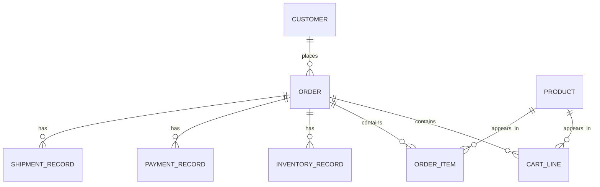

## A simple way to think about one order

One order is not just one row.

It grows over time:

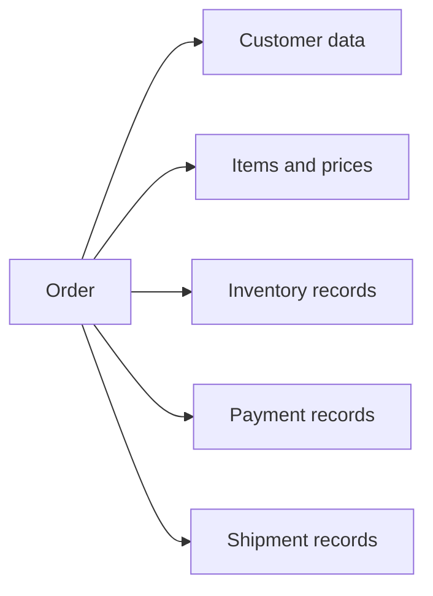

That is how the admin dashboard can later show:

- current status
- payment reference
- inventory result
- shipment carrier
- tracking number
- failure reason

## Seed data

When the database is empty, the infrastructure project seeds example products like:

- Kayak
- Lifejacket
- Soccer Ball
- Stadium
- chess products

That is why the store has products ready to browse on a fresh setup.

---

# 9. How the Two Frontends Use the System

There are two different UIs because they serve two different people.

## 9.1 Blazor customer portal

The Blazor app is for the customer.

The customer can:

- browse products
- filter by category
- add products to cart
- go through checkout
- return from Stripe
- view recent orders and order timelines

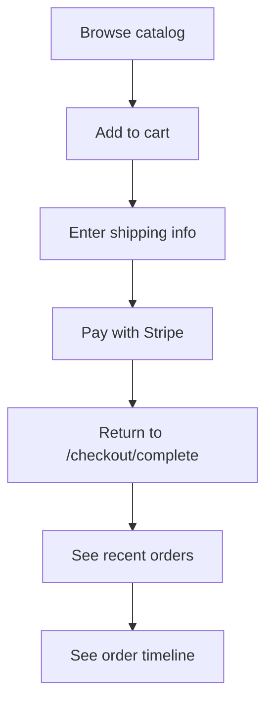

### Blazor data notes

- the cart is stored in browser session storage
- recent order IDs are also stored in browser session storage
- product and order data still come from the API

## 9.2 React admin dashboard

The React dashboard is for admins or operators.

It can:

- list all orders
- filter orders by status
- show failed orders
- open operational details for one order

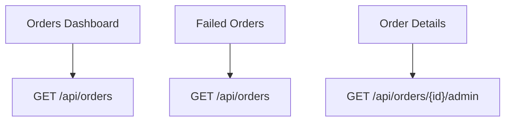

### Very important difference

- Blazor is mainly about **placing** orders
- React admin is mainly about **watching and diagnosing** orders

## Both frontends share the same backend

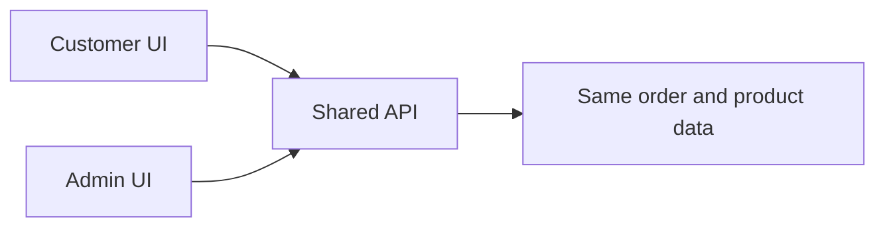

This is a nice design because:

- there is one source of truth
- both UIs see the same order lifecycle
- the admin screen does not need its own separate backend

---

# 10. How the Code Architecture Is Structured

The repository follows a layered design.

The main idea is:

- keep business ideas in the center
- keep external tools around the edges
- let the API and workers use the same core logic

## Layer view

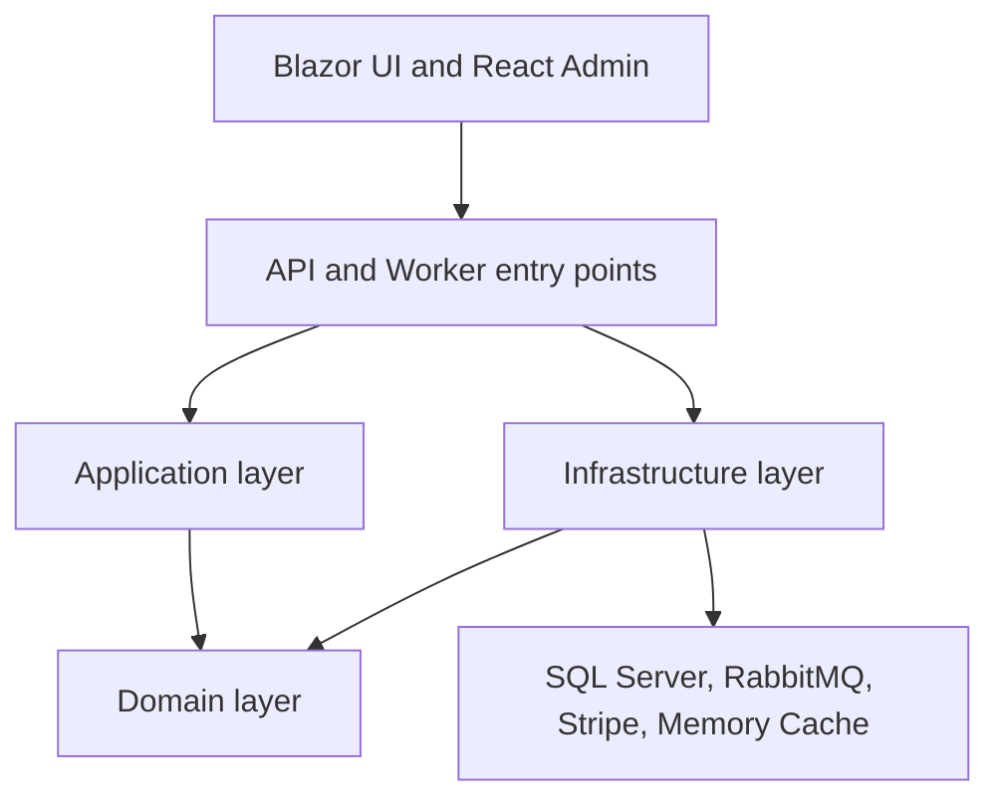

## What each layer means

| Layer | Simple meaning |
| --- | --- |
| Domain | The core business data |
| Application | The system's use cases and workflows |
| Infrastructure | The code that talks to databases, brokers, cache, and Stripe |
| API / Workers | The executable apps that start everything |
| UI | The screens the user sees |

## One HTTP request through the layers

This is roughly what happens when the customer starts checkout:

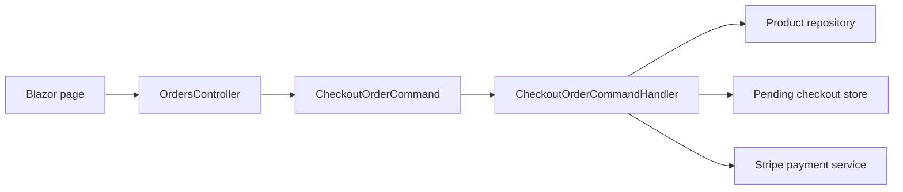

## One query through the layers

This is roughly what happens when the customer loads the catalog:

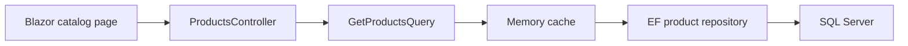

## Why the Application project matters

The `SportsStore.Application` project is where many important use cases live:

- checkout commands
- complete checkout command
- order status queries
- admin order details query
- product queries
- integration event contracts

That makes it the **brain of the workflow**, while infrastructure is the **hands that talk to outside systems**.

---

# 11. Order Statuses and Failure Paths

The system uses an `OrderStatus` enum with these names:

- `Submitted`
- `InventoryPending`
- `InventoryConfirmed`
- `InventoryFailed`
- `PaymentPending`
- `PaymentApproved`
- `PaymentFailed`
- `ShippingPending`
- `ShippingCreated`
- `Completed`
- `Failed`

## Status idea for beginners

You can think of an order status as the answer to:

> "Where is this order right now?"

## Visual status map

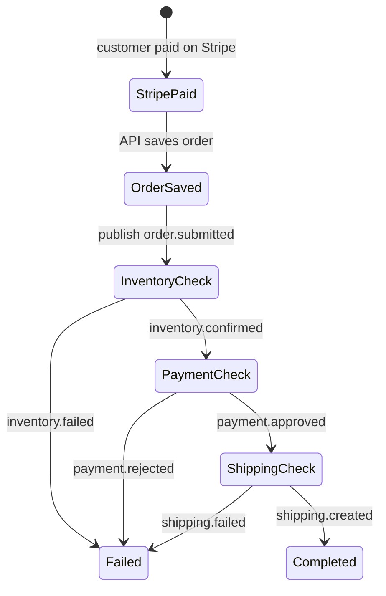

## Failure path picture

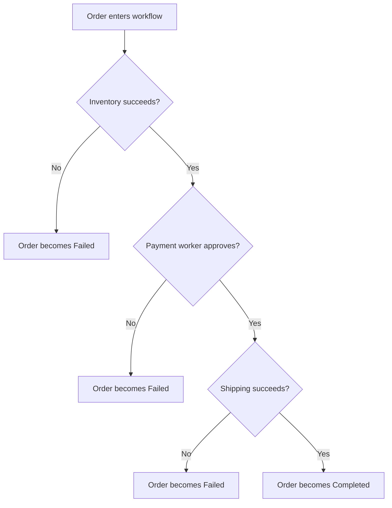

## What the admin sees when something fails

Because each worker writes records into the database, the admin dashboard can show:

- which step failed
- the latest known status
- the failure reason
- payment reference or shipping reference if they exist

## One implementation detail worth knowing

Some enum values such as the `Pending` states exist in the code, but the current implementation mostly jumps directly between stored milestones such as:

- order saved after Stripe payment
- inventory confirmed or failed
- payment approved or failed
- completed or failed

That is normal in student projects: the enum is broader than the currently used path.

---

# 12. End-to-End Summary

If you remember only one story, remember this one:

1. The customer uses the Blazor storefront.
2. The API prepares a Stripe checkout session.
3. After Stripe confirms payment, the API saves the order.
4. The API publishes `order.submitted` to RabbitMQ.
5. Inventory worker processes the message and updates the database.
6. If inventory succeeds, payment worker continues.
7. If payment succeeds, shipping worker continues.
8. Every step writes back to SQL Server.
9. The customer UI and admin UI read the latest state from the API.

## Final big picture

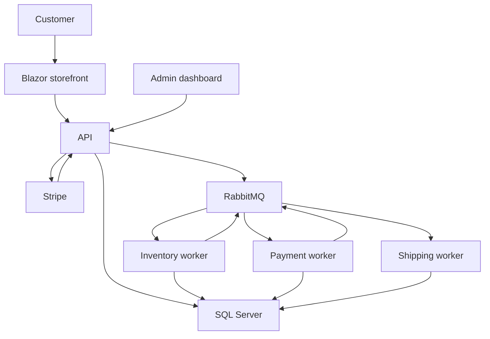

## Final one-sentence explanation

This system is a shop where the **API starts the order**, **RabbitMQ passes work between specialized background services**, and **SQL Server stores the latest truth that both frontends can display**.
